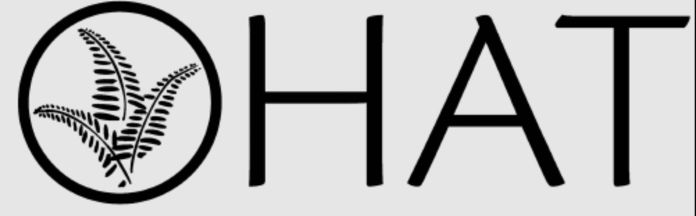

Modified 2025-11-02 @ 19:09

```{r setup, include=FALSE}
knitr::opts_chunk$set(echo = TRUE)
```

# HAT Logos
<details><summary><b><i>Click open to see `HAT Logo Examples`</i></b></summary><p>
Change size format in URL
https://images.squarespace-cdn.com/content/v1/5e3c5b7e5460c55405a6d4d6/a8c2fb30-96fd-4042-925f-e76c7040dce6/Black+Logo+2.png?format=5w
  

  
- poor resolution  


  
- poor resolution
</p></details>

# Load Libraries
```{r load-libraries}
library(tidyverse)
library(plotly)
library(htmlwidgets)
library(stats) # for aggregate function mean
```


# Data Import
```{r data-import-1}
# 3 Sites from HAT Covenants website
HAT_sites <- read.csv("data/HAT-Sites.csv")
HAT_sites
# Warning in read.table(file = file, header = header, sep = sep, quote = quote,  : incomplete final line found by readTableHeader on 'data/HAT-Sites.csv'
## creating a dataframe all columns need to be of equal length - gave the empty columns NA value >> still get this message???

# Oak Haven Meta Data
oakhaven_2025_metadata <- read.csv("data/HAT-OH-MetaData.csv")
oakhaven_2025_metadata
# Warning in read.table(file = file, header = header, sep = sep, quote = quote,  :  incomplete final line found by readTableHeader on 'data/HAT-OH-MetaData.csv'
  
# Oak Haven Cover data 2025
## cleaned and wrangled from file
## HAT-Meadow Monitoring Spreadsheet 2025 - Oak Haven Park example.xlsx
oakhaven_2025_cover <- read.csv("data/HAT-MeadowMonitoring-2025-OakHaven.csv")
# oakhaven_2025_cover


# Oak Haven Timeline
OH_timeline <- read.csv("data/Timeline-OH.csv")
OH_timeline


# Oak Haven Timeline for timevix
Timeline_OH_vis <- read.csv("data/OH_timeline_date_timevis.csv", header = TRUE, sep = ",")
# Warning in read.table(file = file, header = header, sep = sep, quote = quote,  :  incomplete final line found by readTableHeader on 'data/Timeline-OH.csv'
```

# Data Exploration
- info `str()`
```{r data-info-str}
str(oakhaven_2025_cover)
```

## Data Transformation
### Date
```{r data-transform-date}
oakhaven_2025_cover$Date <- as.Date(oakhaven_2025_cover$Date)
str(oakhaven_2025_cover)

str(OH_timeline)
OH_timeline$When <- as.Date(OH_timeline$When)
str(OH_timeline)
write.csv(OH_timeline, "data/OH_timeline_date.csv", row.names = FALSE)
```
# Data Wrangling
## Concatenate QUniqiueID
```{r concatenate-unique-quadrat}
colnames(oakhaven_2025_cover)
oakhaven_2025_cover$QUniqueID <- paste(oakhaven_2025_cover$MonitorID, oakhaven_2025_cover$Quadrat, oakhaven_2025_cover$QuadratLocation_m, sep = "_")
oakhaven_2025_cover$QUniqueID
```

### Save csv with new column `QUniqueID`
- use for Shiny app
```{r save-csv-new-col-QUniqueID}
write.csv(oakhaven_2025_cover, "data/oakhaven_2025_cover.csv", row.names = FALSE)
```

## Filter Subset
### Native vs Invasive
```{r subset-native-inv}
oakhaven_2025_cover_nat <- oakhaven_2025_cover[oakhaven_2025_cover$Native_or_Invasive == "Native",]

oakhaven_2025_cover_inv <- oakhaven_2025_cover[oakhaven_2025_cover$Native_or_Invasive == "Invasive",]

oakhaven_2025_cover_mix <- oakhaven_2025_cover[oakhaven_2025_cover$Native_or_Invasive == "Mixed",]
```

### Treated / Untreated
```{r subset-treated-untreated}
colnames(oakhaven_2025_cover)
oakhaven_2025_cover_untreat <- oakhaven_2025_cover[oakhaven_2025_cover$Treated == "Untreated",]

oakhaven_2025_cover_treat <- oakhaven_2025_cover[oakhaven_2025_cover$Treated == "Treated",]
```

## Reduce Columns

```{r reduce-col}
colnames(oakhaven_2025_cover_treat)
oakhaven_2025_cover_treat_sub <-oakhaven_2025_cover_treat[-c(1,2,6,7,9,10,11,12)]
# oakhaven_2025_cover_treat_sub
str(oakhaven_2025_cover_treat_sub)

colnames(oakhaven_2025_cover_untreat)
oakhaven_2025_cover_untreat_sub <-oakhaven_2025_cover_untreat[-c(1,2,6,7,9,10,11,12)]
# oakhaven_2025_cover_untreat_sub
str(oakhaven_2025_cover_untreat_sub)
```

## Summary Stats
```{r summary-stats}
summary(oakhaven_2025_cover_treat_sub)
summary(oakhaven_2025_cover_untreat_sub)
```
## Wrangling with Dplyr
### Percent Cover By Treatment Group  
```{r data-wrangle-dplyr-group-mean-cover-treat}

colnames(oakhaven_2025_cover)

oakhaven_2025_cover_mean_by_group_treat <- oakhaven_2025_cover %>%
  group_by(Treated, Native_or_Invasive) %>%
  summarise(mean_value = mean(PercentCover), 
            sd_value = sd(PercentCover))
oakhaven_2025_cover_mean_by_group_treat
```


### Percent Cover By Species Group  
```{r data-wrangle-dplyr-group-mean-cover-species}

oakhaven_2025_cover_mean_by_group_species <- oakhaven_2025_cover %>%
  group_by(Species, Treated, Native_or_Invasive) %>%
  summarise(mean_value = mean(PercentCover), 
            sd_value = sd(PercentCover))
oakhaven_2025_cover_mean_by_group_species

```


# Cover Percentage

## sort by species
```{r sort-species}
# Treated
oakhaven_2025_cover_treat_sub_srt_sp <- oakhaven_2025_cover_treat_sub[rev(order(oakhaven_2025_cover_treat_sub$Species)), ]
# oakhaven_2025_cover_treat_sub_srt_sp

# untreated
oakhaven_2025_cover_untreat_sub_srt_sp <- oakhaven_2025_cover_untreat_sub[rev(order(oakhaven_2025_cover_untreat_sub$Species)), ]
# oakhaven_2025_cover_untreat_sub_srt_sp
```

## sort by native/inv
```{r sort-nat-inv}
# Treated
oakhaven_2025_cover_treat_sub_srt_nat <- oakhaven_2025_cover_treat_sub[rev(order(oakhaven_2025_cover_treat_sub$Native_or_Invasive)), ]
# oakhaven_2025_cover_treat_sub_srt_nat

# untreated
oakhaven_2025_cover_untreat_sub_srt_nat <- oakhaven_2025_cover_untreat_sub[rev(order(oakhaven_2025_cover_untreat_sub$Native_or_Invasive)), ]
# oakhaven_2025_cover_untreat_sub_srt_nat
```

## ** Mean Percent Cover group_by Species
NOTE: *** these are the correct mean values
- not divided by natives
- using `dplyr`
```{r group-species-mean-cover}

oakhaven_2025_cover_treat_sp_mean <- oakhaven_2025_cover_treat %>%
  group_by(Species) %>%
  summarise(meanPercentCover = mean(PercentCover))

# colnames(oakhaven_2025_cover_treat_mean_by_sp)
# Round treated
oakhaven_2025_cover_treat_sp_mean$meanPercentCover <- round(oakhaven_2025_cover_treat_sp_mean$meanPercentCover, digits = 2)
# oakhaven_2025_cover_treat_sp_mean$meanPercentCover

# Untreated
oakhaven_2025_cover_untreat_sp_mean <- oakhaven_2025_cover_untreat %>%
  group_by(Species) %>%
  summarise(meanPercentCover = mean(PercentCover))

# Round untreated
oakhaven_2025_cover_untreat_sp_mean$meanPercentCover <- round(oakhaven_2025_cover_untreat_sp_mean$meanPercentCover, digits = 2)
# oakhaven_2025_cover_untreat_sp_mean
```


### ?? Add column Native/Inv matching
```{r add-match-nat-column}
# https://stackoverflow.com/questions/37034242/add-a-new-column-to-a-dataframe-using-matching-values-of-another-dataframe

# add new column
oakhaven_2025_cover_treat_sp_mean$Native_or_Invasive <- NA
oakhaven_2025_cover_untreat_sp_mean$Native_or_Invasive <- NA

```

## ?? Match Native Invasive
```{r match-nat-inv-mean}
# match values
# table1$val2 <- table2$val2[match(table1$pid, table2$pid)]
oakhaven_2025_cover_treat_sp_mean$Native_or_Invasive <- oakhaven_2025_cover$Native_or_Invasive[match(oakhaven_2025_cover_treat_sp_mean$Species, oakhaven_2025_cover$Species)]
 oakhaven_2025_cover_treat_sp_mean
# 
# # match values
# # table1$val2 <- table2$val2[match(table1$pid, table2$pid)]
oakhaven_2025_cover_untreat_sp_mean$Native_or_Invasive <- oakhaven_2025_cover$Native_or_Invasive[match(oakhaven_2025_cover_untreat_sp_mean$Species, oakhaven_2025_cover$Species)]
oakhaven_2025_cover_untreat_sp_mean

```


## New dataframe with all Mean % Coverage
```{r new-df-mean-percent-cover}

oakhaven_2025_cover_treat_sp_mean
colnames(oakhaven_2025_cover_treat_sp_mean)

# create new dataframe from old
OH_2025_perc_cover_treat_mean <- oakhaven_2025_cover_treat_sp_mean # 16 obs
OH_2025_perc_cover_untreat_mean <- oakhaven_2025_cover_untreat_sp_mean # 16 obs

# Rename unique treat or untreat meanPercentCover columns
names(OH_2025_perc_cover_treat_mean)[names(OH_2025_perc_cover_treat_mean) == "meanPercentCover"] <- "t_meanPercentCover"
names(OH_2025_perc_cover_untreat_mean)[names(OH_2025_perc_cover_untreat_mean) == "meanPercentCover"] <- "u_meanPercentCover"
# drop column to avoid duplication upon merge
colnames(OH_2025_perc_cover_untreat_mean)
#OH_2025_perc_cover_untreat_mean <-OH_2025_perc_cover_untreat_mean[-c(3)]

# merge ?
OH_2025_perc_cover_treat_mean_merge <- merge(OH_2025_perc_cover_treat_mean, OH_2025_perc_cover_untreat_mean, by ="Species", all = TRUE)  # only 12 obs

# drop Native / Invasive column
colnames(OH_2025_perc_cover_treat_mean_merge)

OH_2025_perc_cover_treat_mean_merge <- OH_2025_perc_cover_treat_mean_merge[-c(3,5)]

# table1$val2 <- table2$val2[match(table1$pid, table2$pid)]

```

### Add column Native/Inv for matching
```{r add-match-nat-column-merge}
# https://stackoverflow.com/questions/37034242/add-a-new-column-to-a-dataframe-using-matching-values-of-another-dataframe

# add new column
OH_2025_perc_cover_treat_mean_merge$Native_or_Invasive <- NA

```

## Match Native Invasive
```{r match-nat-inv-mean-merge}
# match values
# table1$val2 <- table2$val2[match(table1$pid, table2$pid)]
OH_2025_perc_cover_treat_mean_merge$Native_or_Invasive <- oakhaven_2025_cover$Native_or_Invasive[match(OH_2025_perc_cover_treat_mean_merge$Species, oakhaven_2025_cover$Species)]
```


## ?? Mean Cover Group by Species Treated
```{r mean-cover-group-species-treat}


```


## ?? Mean Cover Group by Species Untreated
```{r mean-cover-group-species-untreat}


```


## Group Quadrats
- how to identify each quadrat as a separate group ... with a unique identifier e.g. gave each of four monitoring sessions a unique ID (treated / untreated + initials of 2 different teams)
- concatenate unique monitoring session ID + 

### Unique Quadrat IDs 
```{r group-by-quadrat-unique}
unique(oakhaven_2025_cover$QUniqueID)
length(unique(oakhaven_2025_cover$QUniqueID)) # S/B 12
```

### Group by Quadrats
```{r group-by-quadrats}
oakhaven_group_quadrats <- oakhaven_2025_cover %>% dplyr::group_by(QUniqueID)
```

#### Species in each Quadrat
- e.g. logic for each unique quadrat list species
```{r unique-quadrats}
str(oakhaven_group_quadrats)
unique(oakhaven_group_quadrats$QUniqueID)
```

```{r for-loop, include = FALSE}
### For loops
# for (i in 1:length(unique(oakhaven_group_quadrats$QUniqueID))) {
# print(oakhaven_group_quadrats$Species)
# }
```


## Group Species

### Unique Species
```{r group-by-species-unique}
colnames(oakhaven_2025_cover)
oakhaven_2025_cover_sp_unique <- unique(oakhaven_2025_cover$Species)
oakhaven_2025_cover_sp_unique
length(unique(oakhaven_2025_cover$Species)) #25 > 20 after removing empty trailing spaces from 5
```

### Group by Species
```{r group-by-species}
oakhaven_group_species <- oakhaven_2025_cover %>% dplyr::group_by(Species)
oakhaven_group_species
```


# Species Richness
- total number of species per Site

## Unique Species
```{r unique-species-total}
length(unique(oakhaven_2025_cover$Species)) #20
length(unique(oakhaven_2025_cover_nat$Species)) #12
length(unique(oakhaven_2025_cover_inv$Species)) #5
# length(unique(oakhaven_2025_cover_unkn_mix$Species)) #4
```

## Filter by Treatment

```{r species-richness-filter}

colnames(oakhaven_2025_cover)
oakhaven_2025_cover_sub <-oakhaven_2025_cover[-c(1:6,8:12)]

# Native Treated
oakhaven_2025_cover_sub_nat_tr <- oakhaven_2025_cover_sub[(oakhaven_2025_cover_sub$Native_or_Invasive == "Native") & (oakhaven_2025_cover_sub$Treated == "Treated"), ]
oakhaven_2025_cover_sub_nat_tr
length(unique(oakhaven_2025_cover_sub_nat_tr$Species)) #11
unique(oakhaven_2025_cover_sub_nat_tr$Species)

# Native Untreated
oakhaven_2025_cover_sub_nat_untr <- oakhaven_2025_cover_sub[(oakhaven_2025_cover_sub$Native_or_Invasive == "Native") & (oakhaven_2025_cover_sub$Treated == "Untreated"), ]
oakhaven_2025_cover_sub_nat_untr
length(unique(oakhaven_2025_cover_sub_nat_untr$Species)) #11
unique(oakhaven_2025_cover_sub_nat_untr$Species)

# Invasive Treated
oakhaven_2025_cover_sub_inv_tr <- oakhaven_2025_cover_sub[(oakhaven_2025_cover_sub$Native_or_Invasive == "Invasive") & (oakhaven_2025_cover_sub$Treated == "Treated"), ]
oakhaven_2025_cover_sub_inv_tr
length(unique(oakhaven_2025_cover_sub_inv_tr$Species)) #4
unique(oakhaven_2025_cover_sub_inv_tr$Species)

# Invasive Untreated
oakhaven_2025_cover_sub_inv_untr <- oakhaven_2025_cover_sub[(oakhaven_2025_cover_sub$Native_or_Invasive == "Invasive") & (oakhaven_2025_cover_sub$Treated == "Untreated"), ]
oakhaven_2025_cover_sub_inv_untr
length(unique(oakhaven_2025_cover_sub_inv_untr$Species)) #4
unique(oakhaven_2025_cover_sub_inv_untr$Species)
```

## Report: Species Richness Values
- There are `r length(unique(oakhaven_2025_cover_sub_nat_tr$Species))` unique native plant species, and `r length(unique(oakhaven_2025_cover_sub_inv_tr$Species))` invasive Plant species found in both the Treated and Untreated monitoring locations at Oak Haven Park
- The **native plant species** are: `r unique(oakhaven_2025_cover_sub_nat_tr$Species)`  
- The **invasive plant species** are: `r unique(oakhaven_2025_cover_sub_inv_tr$Species)`  

---

# Plots

## Time Plots
### Timevis
- each event needs a start and end time
```{r timevis}
# https://github.com/daattali/timevis
library(timevis)
# view minimal timeline
# timevis()

# create new vile with changed column names for timevix
# change When to start
# names(OH_timeline)[names(OH_timeline) == "When"] <- "start"
# names(OH_timeline)[names(OH_timeline) == "What"] <- "content"
# add new column and duplicate When
# if an end date
# OH_timeline$end <- NA 
# OH_timeline$end <- OH_timeline$start

OH_timeline
timevis(Timeline_OH_vis)

```


### Timelines 1
`OH_timeline`
```{r gdgplot-timeline-OH}
# https://www.r4photobiology.info/galleries/plot-timeline.html
colnames(OH_timeline)
library(ggrepel)
OH_timeline_plot <- ggplot(OH_timeline, aes(x = When, y = EventType, label = paste(Where, When, sep = "-"))) +
  # label = paste(wt, "^(", cyl, ")", sep = "")),
#OH_timeline_plot <- ggplot(OH_timeline, aes(x = When, y = EventType, label = What)) +
  
  geom_line() +
  geom_point(data = . %>% filter(Where != "")) +
  # geom_point(data = . %>% filter(What != "")) +
  # geom_text(aes(colour = EventType), hjust = -0.3, angle = 45) +
   # geom_text(size = 1.0) +
  #geom_text(aes(colour = EventType), hjust = -0.3, angle = 45, size = 3.0) +
   geom_text_repel(aes(colour = EventType), 
     direction = "y",
                   size = 2.5,
                    point.padding = 0.5,
                    hjust = 0,
                    box.padding = 1,
                    seed = 123) +
  scale_x_date(name = "When", date_breaks = "4 months",
               expand = expansion(mult = c(0.0, 0.9))) +
              # expand = expansion(mult = c(0.05, 0.9))) +
  # coord_cartesian(xlim = c("2024-01-01", "2026-01-01")) +
  # scale_x_continuous(limits = c(2024-01-01, 2026-01-01)) +
  scale_y_discrete(name = "",
                   expand = expansion(mult = c(0.2, 0.95))) +
  scale_colour_manual(values = c(Cover_Monitor = "seagreen", Treatment_Event = "purple"), guide = "none") +
  theme_minimal() +
    labs(title='Timeline of HAT GOE Monitoring',
    # subtitle='HAT GOE Monitoring',
    # subtitl='Oak Haven Park',
    caption = "Chart by Wendy Anthony \n 2025-10-06")

OH_timeline_plot
```

### Timelines 2
`OH_timeline`
```{r gdgplot-timeline-OH-2}
# https://www.r4photobiology.info/galleries/plot-timeline.html
colnames(OH_timeline)
library(ggrepel)
OH_timeline_plot <- ggplot(OH_timeline, aes(x = When, y = EventType, label = paste(Where, When, sep = "-"))) +
  # label = paste(wt, "^(", cyl, ")", sep = "")),
#OH_timeline_plot <- ggplot(OH_timeline, aes(x = When, y = EventType, label = What)) +
  
  geom_line() +
  geom_point(data = . %>% filter(Where != "")) +
  # geom_point(data = . %>% filter(What != "")) +
  # geom_text(aes(colour = EventType), hjust = -0.3, angle = 45) +
   # geom_text(size = 1.0) +
   geom_text_repel(direction = "y",
                   size = 2.5,
                    point.padding = 0.5,
                    hjust = 0,
                    box.padding = 1,
                    seed = 123) +
  scale_x_date(name = "When", date_breaks = "4 months",
               expand = expansion(mult = c(0.0, 0.9))) +
              # expand = expansion(mult = c(0.05, 0.9))) +
  # coord_cartesian(xlim = c("2024-01-01", "2026-01-01")) +
  # scale_x_continuous(limits = c(2024-01-01, 2026-01-01)) +
  scale_y_discrete(name = "",
                   expand = expansion(mult = c(0.2, 0.95))) +
  scale_colour_manual(values = c(Cover_Monitor = "seagreen", Treatment_Event = "purple"), guide = "none") +
  theme_minimal() +
    labs(title='Timeline of HAT GOE Monitoring',
    # subtitle='HAT GOE Monitoring',
    # subtitl='Oak Haven Park',
    caption = "Chart by Wendy Anthony \n 2025-10-06")

OH_timeline_plot
```


## ggplot2 Chart

### ??? Species Richness Plot
```{r species-richness-plot}

# colnames(oakhaven_group_quadrats)
# 
# oakhaven_2025_cover_nat_richness_plot  <-  ggplot(unique(oakhaven_2025_cover_nat),
#                     aes(x = unique(oakhaven_2025_cover_nat$Species))) +
#                       ylim(0, 100) +
#                     #geom_bar(stat = "identity", fill = "seagreen") +
#                     geom_bar(stat = "identity") +
#                     theme_minimal() + #get rid of grey background and tick marks
#                     # theme(legend.position="none") + #remove legend
#                     theme(axis.text.x = element_text(angle = 25, vjust = 1, hjust=1, size = 7)) +
#                     labs(title='Species Richness',
#                       subtitle='Oak Haven Park',
#                       caption = "Chart by Wendy Anthony \n 2025-10-06")
# oakhaven_2025_cover_nat_richness_plot

# ## ggplotly
#     ggplotly(tooltip = c("x", "y", "fill"), oakhaven_2025_cover_nat_richness_plot) %>%
#       config(displayModeBar = FALSE) %>% # This line disables the modebar
#       layout(title = list(
#         text = "Species Richness<br><sup>Oak Haven Park</sup>",
#         y = 0.95), # Adjust vertical position if needed
#         xaxis = list(title = 'Unique Quadrat'),
#         yaxis = list(title = 'Percentage Cover'),
#         annotations = list(x = 1, y = -0.1, text = "Chart by Wendy Anthony\n2025-10-06"
#               # no legend
#                            ,
#              showarrow = F, xref='paper', yref='paper',
#              xanchor='right', yanchor= 'auto', xshift=0, yshift=0,
#              font = list(size=8, color="grey")
#              ))
```

### Quadrat per Species 
```{r ggplot-quadrat-per-species}

colnames(oakhaven_group_quadrats)

oakhaven_group_quadrats_species_plot  <-  ggplot(oakhaven_group_quadrats, 
                    aes(x = Species, y = PercentCover, fill = QUniqueID)) +
                      ylim(0, 100) +
                    #geom_bar(stat = "identity", fill = "seagreen") +
                    geom_bar(stat = "identity") +
                    theme_minimal() + #get rid of grey background and tick marks 
                    # theme(legend.position="none") + #remove legend 
                    theme(axis.text.x = element_text(angle = 25, vjust = 1, hjust=1, size = 7)) +
                    labs(title='Comparing Quadrats Percentage Species Coverage',
                      subtitle='Oak Haven Park',
                      caption = "Chart by Wendy Anthony \n 2025-10-05")
oakhaven_group_quadrats_species_plot

## ggplotly
    ggplotly(tooltip = c("x", "y", "color", "fill"), oakhaven_group_quadrats_species_plot) %>%
      config(displayModeBar = FALSE) %>% # This line disables the modebar
      layout(title = list(
        text = "Comparing Quadrats Percentage Species Coverage<br><sup>Oak Haven Park</sup>",
        y = 0.95), # Adjust vertical position if needed
        xaxis = list(title = 'Unique Quadrat'),
        yaxis = list(title = 'Percentage Cover'),
        annotations = list(x = 1, y = -0.1, text = "Chart by Wendy Anthony\n2025-10-05",
             showarrow = F, xref='paper', yref='paper',
             xanchor='right', yanchor= 'auto', xshift=0, yshift=0,
             font = list(size=8, color="grey")
             ))
```


### Species per Quadrat
```{r ggplot-species-per-quadrat}

colnames(oakhaven_group_quadrats)

oakhaven_group_quadrats_species_plot  <-  ggplot(oakhaven_group_quadrats, 
                    aes(x = QUniqueID, y = PercentCover, fill = Species)) +
                      ylim(0, 100) +
                    #geom_bar(stat = "identity", fill = "seagreen") +
                    geom_bar(stat = "identity") +
                    theme_minimal() + #get rid of grey background and tick marks 
                    # theme(legend.position="none") + #remove legend 
                    theme(axis.text.x = element_text(angle = 25, vjust = 1, hjust=1, size = 7)) +
                    labs(title='Comparing Quadrats Percentage Species Coverage',
                      subtitle='Oak Haven Park',
                      caption = "Chart by Wendy Anthony \n 2025-10-05")
oakhaven_group_quadrats_species_plot

## ggplotly
    ggplotly(tooltip = c("x", "y", "color", "fill"), oakhaven_group_quadrats_species_plot) %>%
      config(displayModeBar = FALSE) %>% # This line disables the modebar
      layout(title = list(
        text = "Comparing Quadrats Percentage Species Coverage<br><sup>Oak Haven Park</sup>",
        y = 0.95), # Adjust vertical position if needed
        xaxis = list(title = 'Unique Quadrat'),
        yaxis = list(title = 'Percentage Cover'),
        annotations = list(x = 1, y = -0.1, text = "Chart by Wendy Anthony\n2025-10-05"
              # no legend
                           ,
             showarrow = F, xref='paper', yref='paper',
             xanchor='right', yanchor= 'auto', xshift=0, yshift=0,
             font = list(size=8, color="grey")
             )
        )

```

### Native vs Invasive per Quadrat
```{r ggplot-nat-inv-species-per-quadrat}

colnames(oakhaven_2025_cover)

oakhaven_group_quadrats_species_plot  <-  ggplot(oakhaven_2025_cover, 
                    aes(x = QUniqueID, y = PercentCover, fill = Native_or_Invasive)) +
                      ylim(0, 100) +
                    #geom_bar(stat = "identity", fill = "seagreen") +
                    geom_bar(stat = "identity") +
                    theme_minimal() + #get rid of grey background and tick marks 
                    # theme(legend.position="none") + #remove legend 
                    theme(axis.text.x = element_text(angle = 25, vjust = 1, hjust=1, size = 7)) +
                    labs(title='Comparing Quadrats Percentage Native and Invasive Species Coverage',
                      subtitle='Oak Haven Park',
                      caption = "Chart by Wendy Anthony \n 2025-10-05")
oakhaven_group_quadrats_species_plot

## ggplotly
    ggplotly(tooltip = c("x", "y", "color", "fill"), oakhaven_group_quadrats_species_plot) %>%
      config(displayModeBar = FALSE) %>% # This line disables the modebar
      layout(title = list(
        text = "Comparing Quadrats Percentage Species Coverage<br><sup>Oak Haven Park</sup>",
        y = 0.95), # Adjust vertical position if needed
        xaxis = list(title = 'Unique Quadrat'),
        yaxis = list(title = 'Percentage Cover'),
        annotations = list(x = 1, y = -0.1, text = "Chart by Wendy Anthony\n2025-10-05"
              # no legend
                           ,
             showarrow = F, xref='paper', yref='paper',
             xanchor='right', yanchor= 'auto', xshift=0, yshift=0,
             font = list(size=8, color="grey")
             ))
```

### ??? Native Species per Quadrat
- doesn't have `QUniqueID` column
```{r ggplot-nat-secies-per-quadrat}

colnames(oakhaven_group_quadrats)

oakhaven_2025_cover_nat_plot  <-  ggplot(oakhaven_2025_cover_nat, 
                    aes(x = QUniqueID, y = PercentCover, fill = Species)) +
                      ylim(0, 100) +
                    #geom_bar(stat = "identity", fill = "seagreen") +
                    geom_bar(stat = "identity") +
                    theme_minimal() + #get rid of grey background and tick marks 
                    # theme(legend.position="none") + #remove legend 
                    theme(axis.text.x = element_text(angle = 25, vjust = 1, hjust=1, size = 7)) +
                    labs(title='Comparing Quadrats Percentage Native Species Coverage',
                      subtitle='Oak Haven Park',
                      caption = "Chart by Wendy Anthony \n 2025-10-05")

oakhaven_2025_cover_nat_plot

## ggplotly
    ggplotly(tooltip = c("x", "y", "color", "fill"), oakhaven_2025_cover_nat_plot) %>%
      config(displayModeBar = FALSE) %>% # This line disables the modebar
      layout(title = list(
        text = "Comparing Quadrats Percentage Native Species Coverage<br><sup>Oak Haven Park</sup>",
        y = 0.95), # Adjust vertical position if needed
        xaxis = list(title = 'Unique Quadrat'),
        yaxis = list(title = 'Percentage Cover'),
        annotations = list(x = 1, y = -0.1, text = "Chart by Wendy Anthony\n2025-10-05"
              # no legend
                           ,
             showarrow = F, xref='paper', yref='paper',
             xanchor='right', yanchor= 'auto', xshift=0, yshift=0,
             font = list(size=8, color="grey")
             ))
```

### ?? Invasive Species per Quadrat
- doesn't have `QUniqueID` column
```{r ggplot-inv-secies-per-quadrat}
colnames(oakhaven_2025_cover_inv)

oakhaven_2025_cover_inv_plot  <-  ggplot(oakhaven_2025_cover_inv, 
                    aes(x = QUniqueID, y = PercentCover, fill = Species)) +
                      ylim(0, 100) +
                    #geom_bar(stat = "identity", fill = "seagreen") +
                    geom_bar(stat = "identity") +
                    theme_minimal() + #get rid of grey background and tick marks 
                    # theme(legend.position="none") + #remove legend 
                    theme(axis.text.x = element_text(angle = 25, vjust = 1, hjust=1, size = 7)) +
                    labs(title='Comparing Quadrats Percentage Invasive Species Coverage',
                      subtitle='Oak Haven Park',
                      caption = "Chart by Wendy Anthony \n 2025-10-05")

oakhaven_2025_cover_inv_plot

## ggplotly
    ggplotly(tooltip = c("x", "y", "color", "fill"), oakhaven_2025_cover_inv_plot) %>%
      config(displayModeBar = FALSE) %>% # This line disables the modebar
      layout(title = list(
        text = "Comparing Quadrats Percentage Invasive Species Coverage<br><sup>Oak Haven Park</sup>",
        y = 0.95), # Adjust vertical position if needed
        xaxis = list(title = 'Unique Quadrat'),
        yaxis = list(title = 'Percentage Cover'),
        annotations = list(x = 1, y = -0.1, text = "Chart by Wendy Anthony\n2025-10-05"
              # no legend
                           ,
             showarrow = F, xref='paper', yref='paper',
             xanchor='right', yanchor= 'auto', xshift=0, yshift=0,
             font = list(size=8, color="grey")
             ))
```


### Mixed Grass and Moss per Quadrat
```{r ggplot-mixed-secies-per-quadrat}
colnames(oakhaven_2025_cover_mix)

oakhaven_2025_cover_mix_plot  <-  ggplot(oakhaven_2025_cover_mix, 
                    aes(x = QUniqueID, y = PercentCover, fill = Species)) +
                      ylim(0, 100) +
                    #geom_bar(stat = "identity", fill = "seagreen") +
                    geom_bar(stat = "identity") +
                    theme_minimal() + #get rid of grey background and tick marks 
                    # theme(legend.position="none") + #remove legend 
                    theme(axis.text.x = element_text(angle = 25, vjust = 1, hjust=1, size = 7)) +
                    labs(title='Comparing Quadrats Percentage Mixed Species Coverage',
                      subtitle='Oak Haven Park',
                      caption = "Chart by Wendy Anthony \n 2025-10-05")

oakhaven_2025_cover_mix_plot

## ggplotly
    ggplotly(tooltip = c("x", "y", "color", "fill"), oakhaven_2025_cover_mix_plot) %>%
      config(displayModeBar = FALSE) %>% # This line disables the modebar
      layout(title = list(
        text = "Comparing Quadrats Percent Cover Mixed Grass & Moss <br><sup>Oak Haven Park</sup>",
        y = 0.95), # Adjust vertical position if needed
        xaxis = list(title = 'Unique Quadrat'),
        yaxis = list(title = 'Percentage Cover'),
        annotations = list(x = 1, y = -0.1, text = "Chart by Wendy Anthony\n2025-10-05"
              # no legend
                           ,
             showarrow = F, xref='paper', yref='paper',
             xanchor='right', yanchor= 'auto', xshift=0, yshift=0,
             font = list(size=8, color="grey")
             ))
```

### ??? Native Species cover per quadrat
- Warning to knit `("Must request at least one colour from a hue palette."`
```{r ggplot-native}
# # colnames(oakhaven_2025_cover_nat)
# 
# oakhaven_2025_cover_nat_plot  <-  ggplot(oakhaven_2025_cover_nat, 
#                     aes(x = Species, y = PercentCover, fill = QUniqueID)) +
#                       ylim(0, 100) +
#                     #geom_bar(stat = "identity", fill = "seagreen") +
#                     geom_bar(stat = "identity") +
#                     theme_minimal() + #get rid of grey background and tick marks 
#                     # theme(legend.position="none") + #remove legend 
#                     theme(axis.text.x = element_text(angle = 25, vjust = 1, hjust=1, size = 7)) +
#                     labs(title='Comparing Quadrats Percentage Native Species Coverage',
#                       subtitle='Oak Haven Park',
#                       caption = "Chart by Wendy Anthony \n 2025-10-05")
# oakhaven_2025_cover_nat_plot
# 
# ## ggplotly
#     ggplotly(tooltip = c("x", "y", "fill"), oakhaven_2025_cover_nat_plot) %>%
#       config(displayModeBar = FALSE) %>% # This line disables the modebar
#       layout(title = list(
#         text = "Comparing Quadrats Percentage Species Coverage<br><sup>Oak Haven Park</sup>",
#         y = 0.95), # Adjust vertical position if needed
#         xaxis = list(title = 'Unique Quadrat'),
#         yaxis = list(title = 'Percentage Cover'),
#         annotations = list(x = 1, y = -0.1, text = "Chart by Wendy Anthony\n2025-10-05"
#               # no legend
#                            ,
#              showarrow = F, xref='paper', yref='paper',
#              xanchor='right', yanchor= 'auto', xshift=0, yshift=0,
#              font = list(size=8, color="grey")
#              )
#         )
```


## ** Violin Plot Mean Percentage Cover Native / Invasive Untreated

```{r plot-mean-percent-cover-nat-inv-untreat}

oakhaven_2025_cover_untreat_sp_mean
colnames(oakhaven_2025_cover_untreat_sp_mean)

    oakhaven_2025_cover_untreat_sp_mean_violinPlot <- ggplot(oakhaven_2025_cover_untreat_sp_mean,
       # text = paste("Site:", Site),
      aes(x = Native_or_Invasive, y = meanPercentCover)) +
      geom_violin(fill = "seagreen2") +
      geom_boxplot(width = 0.05, fill = "sandybrown") +

#      scale_y_continuous(limits = c(8, 12)) +
      # Replace default palette of pink & blue
      scale_fill_brewer(palette = "Dark2") +
      theme_minimal() + #get rid of grey background and tick marks
      theme(legend.position="bottom") +
      # theme(legend.position="none") + #remove legend
      theme(axis.text.x = element_text(angle = 0, vjust = 1, hjust=1, size = 7)) +
      scale_y_continuous(limits = c(0, 100)) +
      labs(title='Untreated Mean Percentage Cover',
           subtitle='Data: HAT Oak Haven Park',
           caption = "Chart by Wendy Anthony \n 2025-10-29")
    
    
oakhaven_2025_cover_untreat_sp_mean_violinPlot
    
  # plotly
# ggplotly(oakhaven_2025_cover_untreat_sp_mean_violinPlot)
    
```

## ** Violin Plot Mean Percentage Cover Native / Invasive Treated

```{r plot-mean-percent-cover-nat-inv-treat}

oakhaven_2025_cover_treat_sp_mean
colnames(oakhaven_2025_cover_treat_sp_mean)

    oakhaven_2025_cover_treat_sp_mean_violinPlot <- ggplot(oakhaven_2025_cover_treat_sp_mean,
       # text = paste("Site:", Site),
      aes(x = Native_or_Invasive, y = meanPercentCover)) +
      geom_violin(fill = "seagreen2") +
      geom_boxplot(width = 0.05, fill = "sandybrown") +
#      scale_y_continuous(limits = c(8, 12)) +
      # Replace default palette of pink & blue
      scale_fill_brewer(palette = "Dark2") +
      theme_minimal() + #get rid of grey background and tick marks
      theme(legend.position="bottom") +
      # theme(legend.position="none") + #remove legend
      theme(axis.text.x = element_text(angle = 0, vjust = 1, hjust=1, size = 7)) +
      scale_y_continuous(limits = c(0, 100)) +
      labs(title='Treated Mean Percentage Cover',
           subtitle='Data: HAT Oak Haven Park',
           caption = "Chart by Wendy Anthony \n 2025-10-29")
    
    oakhaven_2025_cover_treat_sp_mean_violinPlot
```

### Combine 2 Violin plots
```{r combine-violin-plots}

library("gridExtra")
grid.arrange(arrangeGrob(oakhaven_2025_cover_treat_sp_mean_violinPlot, oakhaven_2025_cover_untreat_sp_mean_violinPlot, ncol = 2))     
```

## Compare Treat to Untreat

### Mean Cover Species plot all
```{r mean-cover-species-all}
colnames(oakhaven_2025_cover_mean_by_group_species)
# create custom colour palette
custom_colours <- c("Treated" = "#7fc97f", 
                    "Untreated" = "#386cb0")

oakhaven_2025_cover_mean_by_group_species_plot <- ggplot(oakhaven_2025_cover_mean_by_group_species, aes(Species, mean_value, fill = Treated)) + 
  geom_bar(stat = "identity", width = 0.5, position = "dodge") +
  theme_minimal() + #get rid of grey background and tick marks
  theme(legend.position ="bottom") + 
  theme(axis.text.x = element_text(angle = 25, vjust = 1, hjust=1, size = 7)) +
    scale_fill_manual(values = custom_colours) +
        labs(title='Comparing All Species Percent Cover by Treatment',
          subtitle='Oak Haven Park',
          caption = "Chart by Wendy Anthony \n 2025-11-02",
          x = "", y = "Mean % Cover", fill = "")
oakhaven_2025_cover_mean_by_group_species_plot
```
### ** Mean Cover Species plot native
```{r mean-cover-species-nat}
colnames(oakhaven_2025_cover_mean_by_group_species)

oakhaven_2025_cover_mean_by_group_species_nat <- oakhaven_2025_cover_mean_by_group_species[oakhaven_2025_cover_mean_by_group_species$Native_or_Invasive == "Native",]

# create custom colour palette
custom_colours <- c("Treated" = "#7fc97f", 
                    "Untreated" = "#386cb0")

oakhaven_2025_cover_mean_by_group_species_nat_plot <- ggplot(oakhaven_2025_cover_mean_by_group_species_nat, aes(Species, mean_value, fill = Treated)) + 
  geom_bar(stat = "identity", width = 0.5, position = "dodge") +
  theme_minimal() + #get rid of grey background and tick marks
  theme(legend.position ="bottom") + 
  theme(axis.text.x = element_text(angle = 25, vjust = 1, hjust=1, size = 7)) +
    scale_fill_manual(values = custom_colours) +
        labs(title='Comparing Native Species Percent Cover by Treatment',
          subtitle='Oak Haven Park',
          caption = "Chart by Wendy Anthony \n 2025-11-02",
          x = "", y = "Mean % Cover", fill = "")
oakhaven_2025_cover_mean_by_group_species_nat_plot
```

### ** Mean Cover Species plot invasive
```{r mean-cover-species-inv}
colnames(oakhaven_2025_cover_mean_by_group_species)

oakhaven_2025_cover_mean_by_group_species_inv <- oakhaven_2025_cover_mean_by_group_species[oakhaven_2025_cover_mean_by_group_species$Native_or_Invasive == "Invasive",]

# create custom colour palette
custom_colours <- c("Treated" = "#7fc97f", 
                    "Untreated" = "#386cb0")

oakhaven_2025_cover_mean_by_group_species_inv_plot <- ggplot(oakhaven_2025_cover_mean_by_group_species_inv, aes(Species, mean_value, fill = Treated)) + 
  geom_bar(stat = "identity", width = 0.5, position = "dodge") +
  theme_minimal() + #get rid of grey background and tick marks
  theme(legend.position ="bottom") + 
  theme(axis.text.x = element_text(angle = 25, vjust = 1, hjust=1, size = 7)) +
    scale_fill_manual(values = custom_colours) +
        labs(title='Comparing Invasive Species Percent Cover by Treatment',
          subtitle='Oak Haven Park',
          caption = "Chart by Wendy Anthony \n 2025-11-02",
          x = "", y = "Mean % Cover", fill = "")
oakhaven_2025_cover_mean_by_group_species_inv_plot
```


### Mean Cover Treated plot
```{r mean-cover-treated}
# create custom colour palette
custom_colours <- c("Invasive" = "#fc8d62", 
                    "Native" = "#66c2a5", 
                    "Mixed" = "#8da0cb")

oakhaven_2025_cover_treat_sp_mean_plot  <- ggplot(oakhaven_2025_cover_treat_sp_mean,
      aes(x = Species, y = meanPercentCover, fill = Native_or_Invasive)) +
      ylim(0, 100) +
      geom_bar(stat = "identity") +
      scale_fill_manual(values = custom_colours, name = "Native/Invasive") +
      theme_minimal() + #get rid of grey background and tick marks
      theme(axis.text.x = element_text(angle = 25, vjust = 1, hjust=1, size = 7)) +
      labs(title='Comparing Mean Percentage Species Coverage Treated',
           subtitle='Oak Haven Park',
           caption = "Chart by Wendy Anthony \n 2025-10-29")
oakhaven_2025_cover_treat_sp_mean_plot
```

### Mean Cover Untreated plot
```{r mean-cover-untreated}
custom_colours <- c("Invasive" = "#fc8d62", 
                    "Native" = "#66c2a5", 
                    "Mixed" = "#8da0cb")

oakhaven_2025_cover_treat_sp_mean_plot  <- ggplot(oakhaven_2025_cover_untreat_sp_mean,
      aes(x = Species, y = meanPercentCover, fill = Native_or_Invasive)) +
      ylim(0, 100) +
      geom_bar(stat = "identity") +
      scale_fill_manual(values = custom_colours, name = "Native/Invasive") +
      theme_minimal() + #get rid of grey background and tick marks
      theme(axis.text.x = element_text(angle = 25, vjust = 1, hjust=1, size = 7)) +
      labs(title='Comparing Mean Percentage Species Coverage Untreated',
           subtitle='Oak Haven Park',
           caption = "Chart by Wendy Anthony \n 2025-10-29")
oakhaven_2025_cover_treat_sp_mean_plot
```


### ** Untreated
- ?? can these be sorted by native/inv
```{r compare-treat-untreat}
colnames(OH_2025_perc_cover_treat_mean_merge)
# create custom colour palette
custom_colours <- c("Invasive" = "#fc8d62", 
                    "Native" = "#66c2a5", 
                    "Mixed" = "#8da0cb")

OH_2025_perc_cover_untreat_mean_merge_plot <- ggplot(OH_2025_perc_cover_treat_mean_merge, 
                    aes(x = Species, y = u_meanPercentCover, fill = Native_or_Invasive)) +
                      ylim(0, 100) +
                    #geom_bar(stat = "identity", fill = "seagreen") +
                    geom_bar(stat = "identity") +
                    scale_fill_manual(values = custom_colours) +
                    theme_minimal() + #get rid of grey background and tick marks 
                    # theme(legend.position="none") + #remove legend 
                    theme(axis.text.x = element_text(angle = 25, vjust = 1, hjust=1, size = 7)) +
                    labs(title='Comparing Mean Species Coverage in Untreated Plots',
                      subtitle='HAT 2025 Cover Data Oak Haven Park',
                      caption = "Chart by Wendy Anthony \n 2025-10-29",
                      y = "Mean % Cover (umtreated)",
                      # Legend Title
          fill = "Native or Invasive")
OH_2025_perc_cover_untreat_mean_merge_plot
```

### ** Treated
- ?? can these be sorted by native/inv
```{r compare-treat-treat}
colnames(OH_2025_perc_cover_treat_mean_merge)
# create custom colour palette
custom_colours <- c("Invasive" = "#fc8d62", 
                    "Native" = "#66c2a5", 
                    "Mixed" = "#8da0cb")

OH_2025_perc_cover_treat_mean_merge_plot <- ggplot(OH_2025_perc_cover_treat_mean_merge, 
                    aes(x = Species, y = t_meanPercentCover, fill = Native_or_Invasive)) +
                      ylim(0, 100) +
                    #geom_bar(stat = "identity", fill = "seagreen") +
                    geom_bar(stat = "identity") +
                    scale_fill_manual(values = custom_colours) +
                    theme_minimal() + #get rid of grey background and tick marks 
                    # theme(legend.position="none") + #remove legend 
                    theme(axis.text.x = element_text(angle = 25, vjust = 1, hjust=1, size = 7)) +
                    labs(title='Comparing Mean Species Coverage in Treated Plots',
                      subtitle='HAT 2025 Cover Data Oak Haven Park',
                      caption = "Chart by Wendy Anthony \n 2025-10-29",
                      y = "Mean % Cover (treated)",
                      # Legend Title
          fill = "Native or Invasive")
OH_2025_perc_cover_treat_mean_merge_plot
```


#### Sort Native / Invasive
- as per `file:///Users/wanthony/Documents/R/Test-Shiny-GOE-Monitor/TEST-GOE-Monitor.html#48_Violin_Subregion_by_Exotic_species`

```{r sort-order}
# Reorder following a precise order
# https://r-graph-gallery.com/267-reorder-a-variable-in-ggplot2.html
# https://stackoverflow.com/questions/18413756/re-ordering-factor-levels-in-data-frame

# Step 1 change character to factor


```


### ** Compare Means Bar Chart Dodge

```{r compare-mean-tr-untr-bar-dodge}
colnames(oakhaven_2025_cover_mean_by_group_treat)
str(oakhaven_2025_cover_mean_by_group_treat)

# create custom colour palette
custom_colours <- c("Invasive" = "#fc8d62", 
                    "Native" = "#66c2a5", 
                    "Mixed" = "#8da0cb")

compare_treat_untreat_bar <- ggplot(oakhaven_2025_cover_mean_by_group_treat, aes(Treated, mean_value, fill = Native_or_Invasive)) + 
  geom_bar(stat = "identity", width = 0.5, position = "dodge") +
  # scale_fill_brewer(palette = "Dark2") +
  theme_minimal() + #get rid of grey background and tick marks
    scale_fill_manual(values = custom_colours) +
        labs(title='Comparing Percent Cover by Treatment',
          subtitle='Oak Haven Park',
          caption = "Chart by Wendy Anthony \n 2025-11-02",
          x = "", y = "Mean % Cover (Untreated)",
          # Legend Title
          fill = "Native or Invasive")
  
compare_treat_untreat_bar
```

### Compare Means and SD Bar Chart Dodge

```{r compare-mean-sd-tr-untr-bar-dodge}
colnames(oakhaven_2025_cover_mean_by_group_treat)
str(oakhaven_2025_cover_mean_by_group_treat)

# create custom colour palette
custom_colours <- c("Invasive" = "#fc8d62", 
                    "Native" = "#66c2a5", 
                    "Mixed" = "#8da0cb")

# https://www.geeksforgeeks.org/r-language/plot-mean-and-standard-deviation-using-ggplot2-in-r/
compare_mean_sd_treat_untreat_bar <- ggplot(oakhaven_2025_cover_mean_by_group_treat, aes(Treated, mean_value, fill = Native_or_Invasive)) + 
  geom_bar(stat = "identity", width = 0.5, position = "dodge") +
  geom_errorbar(aes(ymin = mean_value - sd_value, ymax = mean_value + sd_value), width =.02, position = position_dodge(0.5)) +
  # scale_fill_brewer(palette = "Dark2") +
  theme_minimal() + #get rid of grey background and tick marks
    scale_fill_manual(values = custom_colours) +
        labs(title='Comparing Mean Percent Cover by Treatment',
          subtitle='Oak Haven Parkm - with standard deviation error bars',
          caption = "Chart by Wendy Anthony \n 2025-11-02",
          x = "", y = "Mean % Cover",
          # Legend Title
          fill = "Native or Invasive"
          )
  
compare_mean_sd_treat_untreat_bar
```


### ?? Violin Compare all  - all
- this doesn't show any difference between native/invasive/mixed though error bars do???
```{r compare-tr-untr-violin}

colnames(oakhaven_2025_cover_mean_by_group_treat)

oakhaven_2025_cover_mean_by_group_treat_violin <- ggplot(oakhaven_2025_cover_mean_by_group_treat,
       # text = paste("Site:", Site),
      aes(x = Treated, y = mean_value)) +
      geom_violin(fill = "seagreen2") +
      geom_boxplot(width = 0.05, fill = "sandybrown") +
geom_errorbar(aes(ymin = mean_value - sd_value, ymax = mean_value + sd_value), width =.02) +
      scale_fill_brewer(palette = "Dark2") +
      theme_minimal() + #get rid of grey background and tick marks
      scale_y_continuous(limits = c(0, 100)) +
      labs(title='Compare Mean Percentage Cover by Treatment',
           subtitle='Data: HAT Oak Haven Park',
           caption = "Chart by Wendy Anthony \n 2025-11-02",
           x = "Treatment",
           y = "Mean Percent Cover")

oakhaven_2025_cover_mean_by_group_treat_violin
```


```{r pie-chart-function, include = FALSE}
## Pie Charts
# - Data Cleaning Note: Species need the same spelling (and case - upper / lower)

# piechart <- function(data, mapping) {
#   ggplot(data, mapping) +
#     geom_bar(width = 1) + 
#     coord_polar(theta = "y") + 
#     xlab(NULL) + 
#     ylab(NULL)
# }
# 
# str(oakhaven_2025_cover)
# #oakhaven_2025_cover_species_unique <- unique(oakhaven_2025_cover$Species)
# 
# piechart(oakhaven_group_species_cover_mean, aes(x=oakhaven_group_species_cover_mean, fill = Species))

```


# Leaflet Maps
## 3-Site Map
```{r leaflet-3-sites}
# library(dplyr)
library(leaflet)

# Title control
# (Shackelford, et al., 2024). Global Restore Project. Restoration Futures Lab at the University of Victoria
     title <- '<p style="text-align: center; height: 18px; "><span style="font-size:9px;font-weight:bold; background-color: rgba(255, 255, 255, 0.9;");>GOE Monitoring Covenant Sites Map</span></p>'
     
    # https://rstudio.github.io/leaflet/articles/markers.html
    # Create a palette that maps factor levels to colors
    #####
 # #d95f02 orange; #7570b3 purple; #1b9e77 green
    pal <- colorFactor(c("#1b9e77", "#7570b3", "#d95f02"), domain = c("Central Saanich", "Colwood", "Esquimalt"))
HAT_sites_map  <-  leaflet(HAT_sites) %>%
      addProviderTiles("Esri.WorldImagery") %>%
      addCircleMarkers(
        ~ Lng, ~ Lat,
        #
        color = ~pal(Municipality),
        # color = "yellow",
        weight = 1, # size of circle border
        stroke = TRUE, fillOpacity = 1, #fillOpacity = 0.5
        radius = 4,
        # OM_site_data$
        # "<b>Global Restore Project GOE Monitoring Sites</b>", "<br>", "<i>(Shackelford, et. al., 2005-2022)</i>", "<br><br>",
        popup = paste0(
        "",  "<br>","<br>",
          "<b>Site:</b> ", "<b>", HAT_sites$Site, "</b>",  "<br>",
          "<b>Municipality:</b> ", HAT_sites$Municipality, "<br>",
          "<b>Size:</b> ", HAT_sites$Size_ha, " (ha)", "<br>",
          "<b>First Nations:</b> ", HAT_sites$FirstNations, "<br>",
          # "<b>Project id:</b> ", HAT_sites$ID, "<br>",
          "<b>HAT Status:</b> ", HAT_sites$HAT_Status, "<br>",
          "<b>Co-Covenant:</b> ", HAT_sites$Co_Covenant, " (", HAT_sites$Date, ")", "<br>",
          "<b>Ecosystems:</b> ", HAT_sites$Ecosystems, "<br>",
          "<b>Volunteer Stewardship:</b> ", HAT_sites$Volunteer_Stewardship, "<br>"
          ))  %>%
      addLegend("bottomright", pal = pal, values = HAT_sites$Municipality, title = "Municipality") %>%

      setView(-123.44799, 48.52919, 11) %>%
      # add controls
      #  addMiniMap(width = 150, height = 150, zoomLevelOffset = -4) %>%
      addControl(title, position = "topright")

# Display map
HAT_sites_map

# Save map
saveWidget(HAT_sites_map, "output/HAT_site_map.html")
```


